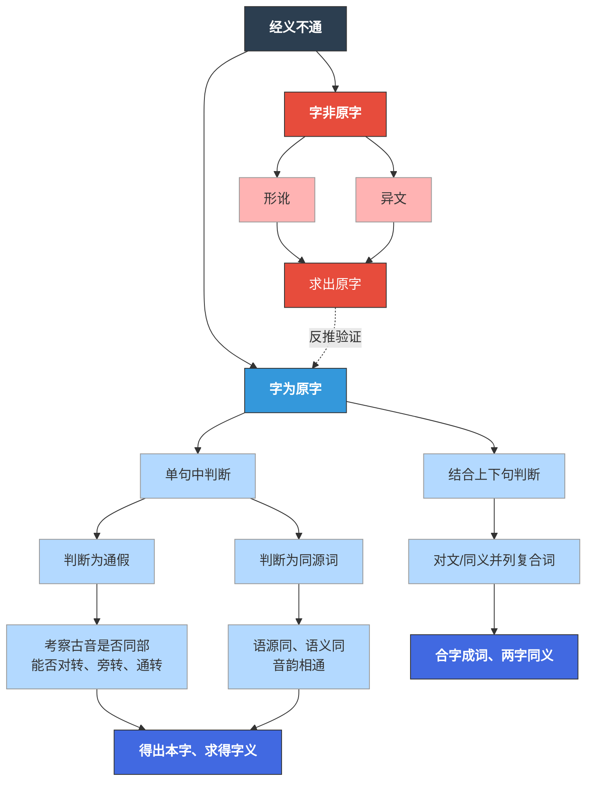

# 高邮二王知识库构建及应用

## 📋 项目概述

这个项目是构建一个网站，里面有两个核心部分：

| 部分 | 内容 | 工程特性 |
|------|------|--------|
| **基底** | 数字化典籍库 | 网站前后端，工程化部分，可以外包 |
| **核心功能** | 检字流程图 | 功能相对简单，可在网站后台用Java/Python实现 |

---

## 📊 项目基本信息

| 项目属性 | 内容 |
|---------|------|
| 序号 | 96 |
| 所在书院 | 明德书院 |
| 供题单位 | 明德书院、数学学院 |
| 指导教师 | 王善文、华建光 |
| 教师职工号 | 20190029、20110033 |
| 一级学科 | 0701数学 |
| 题目类型 | 应用研究 |
| 联系邮箱 | [s_wang@ruc.edu.cn](mailto:s_wang@ruc.edu.cn) |
| 联系电话 | 17721484662 |
| 特色属性 | 具有国学和数学跨学科属性 |

### 项目简介

高邮王念孙、王引之是清代乾嘉学术代表人物，在经字互证方法论指导下，长期校读中国早期经典，成果丰硕，结论谨严。本项目拟借助数智技术，以高邮二王四种为核心，在深入标注的基础上，构建高邮二王古典知识库，重建高邮二王知识生产模式，为早期中国文明或中国古典学研究开发系列数字平台。

---

## 一、高邮二王与高邮王氏四种

高邮二王指清代乾嘉学派的两位代表人物——**王念孙**与其子**王引之**。父子二人致力研究音韵、训诂、校勘之学，学术成就卓著。

### 高邮王氏四种

王氏父子的代表作合称"高邮王氏四种"，包括：

1. **《广雅疏证》**（王念孙撰，末卷为王引之补）
   - 以"因声求义"的方法疏证三国张揖《广雅》
   - 提出"声同字异，声近义同"的观点

2. **《读书杂志》**（王念孙撰）
   - 校勘《逸周书》《战国策》《史记》《汉书》等先秦两汉典籍

3. **《经义述闻》**（王引之撰）
   - 研读群经的札记，汇集了父子二人的训诂成果
   - 书中约三分之一条目标记为"家大人曰"，体现父子学术传承
   - 全书纠正汉唐旧注千余条，使千年误解涣然冰释

4. **《经传释词》**（王引之撰）
   - 系统研究上古汉语虚词的专著
   - 凡释一百六十字

### 学术渊源与风格

二王学术的直接渊源是戴震。王念孙12岁受业于戴震，继承其"由声音文字求训诂，由训诂求义理"的治学路径。父子二人又在实践中发展出**"实事求是、无征不信"**的治学精神，既反对宋明理学的凿空，又超越吴派汉学的墨守，形成**"广博精深、综贯会通"**的学术风格。

---

## 二、侧重点："经字互证""一声之转"的研究方法

### 方法核心

总的来说，**形、音、义知一推三**是二王训诂方法的核心。

### 具体应用例子

- **郑玄释为**："才能不如我所知"
- **王引之指出**：
  - "不我知"为否定句宾语前置，应为"不知我"
  - "能"与"而"古为一字
  - 此后许多经典的"能"的训释被推翻，转训为"而"

#### 2. 双声词考释——犹豫

**前人误将双声词拆开阐释：**
- 一说：犹为犬，每豫在前，待人不得，又来迎候
- 一说：豫字从象，认为犹豫都是多疑之兽

**王引之提出：**

> 犹豫，双声字也，字或作"犹与"，分言之则曰"犹"，曰"豫"…合言之则曰"犹豫"，转之则曰"夷犘"，曰"容与"…

具体步骤：
1. 旁征引书证，证明上述双声词实有用例
2. 类比"嫌疑"与"狐疑"这组同义连绵词
3. 说明其为"一声之转"
4. **结论**：犹豫 = 夷犘 = 容与

#### 3. 名与字的考释——宋公子术字乐甫

若简述考释过程，则可表述为：
- 术 = 遂（古字通）
- 遂 = 安（书证）
- 安 = 乐（书证）
- **结论**：遂 = 乐

这也是**形、音、义知一推三**的重要应用。

---

## 三、对于知识库的构想

### （一）网站基础（可借鉴章太炎网站）

#### 1. 内部数据库：二王著作的深度标注与全文检索

**高邮王氏四种全文数字化**：将"王氏四种"各版本（家刻本、点校本等）进行OCR识别和文本校对，实现全文检索。

**图文对照**：提供古籍扫描件与电子文本的对照阅读，便于核对原文。

**字词标注**：对通假字、联绵词、同源词进行古音标注（声母、韵部等），支持按古音系联检索。例如输入"犹豫"可自动关联"犹与""夷犘""容与"等变体。

**案例库**：将二王的考据条目按经典（《诗经》《尚书》等）分类，提炼其论证逻辑（发疑—预设—取证—释理—结论），形成可交互的"考据知识图谱"。

#### 2. 外部数据库：整合音韵、训诂工具与学术资源

**音韵支持**：外接《广韵》《集韵》及上古音数据库，或参考书（如郭锡良《汉字古音手册》），检索今字可得出古音。

**训诂支持**：外接《尔雅》《说文》等字典辞书，查询字词的古训和书证。

**研究文献库**：收集国内外二王研究论著，用Zotero等工具管理，提供按主题、作者、年代等多维度检索，与著作库相互链接。

### （二）网站特色：高邮二王知识生产模式

通过"一声之转"流程图展现核心特色，以古韵二十二部为框架，将二王考释中涉及的转语（如"无虑—勿虑—摹略—孟浪"）进行声转路径的可视化。

### （三）网站目标

**服务早期中国文明研究**：通过"一声之转"的研究范例，为古典学、语言学研究者提供便捷的考证工具。

**重建知识生产模式**：通过数字化手段，便利研究者从海量文献中提取证据、归纳通例。

**弥补既有研究不足**：目前虽有《高邮王氏四种》的点校本和电子版，但缺乏深度标注与知识关联；虽有零散的数据库（识典古籍、国学大师网等），但未针对二王设计专门的板块分区。本项目将填补这一空白。

---

## 四、既有研究与不足分析

| 资源类型 | 现状 | 不足 |
|---------|------|------|
| **原文资源** | 有《高邮王氏四种》的点校本和电子版 | 缺乏深度标注与知识关联 |
| **数据库工具** | 有零散的数据库（如识典古籍、国学大师网） | 未针对二王设计专门的板块分区 |
| **知识组织** | 基本的文献汇总 | 缺乏系统的知识图谱和考据流程可视化 |

本项目通过数字技术，将填补这些空白，为学术研究提供更强大的工具支持。
