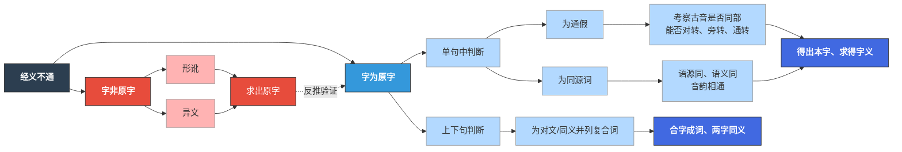

### 1. 团队成员或个人情况（500字以内）

（团队成员或个人的专业能力、成员优势、团队合作等方面的情况，以及就读期间已有的学术、实践经历，已获荣誉奖励等。500字以内。）

本团队由高瓴人工智能学院、信息学院及明德书院5名本科生组成，文理兼备，优势互补，各成员均有与项目核心需求直接对应的学术或工程积累。

**古文字学与语言学基础**：卢飞宇、李汶灿均为强基计划学生，深入修习文字学、语言学与音韵学，并在明德书院"简帛'治国理政'类文献研读与新诠"学术工作坊长期参与古籍精读。卢飞宇对出土文献与传世古书校释有系统研读，已着手梳理高邮二王的典型考释案例及其方法论逻辑；李汶灿兼通编程与大模型应用基础，已尝试将考据过程拆解为结构化步骤。

**学术审核与质量把控**：徐健怡为22级古文字专业同学，已完成文献学、音韵学、训诂学等核心课程修读，曾多次获学习进步奖学金，完成两段专业实习，具备扎实的古文字学理论与实践经验。在项目中，徐健怡负责对卢飞宇、李汶灿的案例梳理与逻辑拆解进行学术规范性审核，确保每条标注的古籍学依据，形成项目的学术质量基准。

**技术与工程积累**：赵梓名专业课成绩优良，精通数据爬取、索引构建与查询处理全流程，曾独立搭建面向中国人民大学科研处与学生处网站的小型检索系统，具备知识库工程落地能力，并参加过美国大学生数学建模竞赛。廖展慧曾独立完成多数据集的预处理、统计分析、回归验证与可视化全链路工作，参加全国大学生数学建模竞赛并荣获北京市二等奖，数据处理与可视化能力经实战检验。

---

### 2. 选题认识（1000字以内）

（对所选题目的了解认知、研究兴趣、研究基础等。1000字以内。）

**一、了解认知：二王方法论的学术地位与核心机制**

高邮王念孙、王引之父子，是清代乾嘉学派的代表人物，其"王氏四种"（《广雅疏证》《读书杂志》《经义述闻》《经传释词》）代表了清代训诂学最高成就。二王学承戴震"由声音文字求训诂"之路，以**"形、音、义知一推三"**为方法论核心，以**"声同字异、声近义同"**为基本命题，开创了"因声求义"的训诂范式，纠正汉唐旧注千余条。

二王方法论的核心机制是**"经字互证"与"一声之转"**。遇经义不通，先判断字是否为原字：若非，则循形讹或异文路径求原字；若是，则通过考察古音（同部、对转、旁转、通转）判断通假或同源关系。此考证路径可以如下流程图示意，亦是本项目知识图谱建模的逻辑原型：

以王氏四种中三则案例为例，可见这一方法的运作：**"犹豫"**——王引之指出此为双声联绵字，不可拆训为兽名，"犹与""夷犹""容与"皆为"一声之转"，义存乎声，不可分训；**"能不我知"**——王引之辨明"不我知"为否定句宾语前置（即"不知我"），"能"古通"而"，纠正郑玄千年误读；**"宋公子术字乐甫"**——术通遂，遂训安，安乐相通，音义互求贯通名与字。这三则案例，是本团队对二王方法论深度研读的成果，也将成为本项目标注语料的核心范例。

**二、研究兴趣：数字化工具的缺位与本题的独特价值**

当前古籍数字化平台（识典古籍、国学大师网等）虽已实现全文检索，却停留于"字"的层面——学者可检索某字在典籍中的出现位置，却无法复现王引之如何通过多步推演将"犹豫""夷犹""容与"等形态各异的词系联为同一音义源头。

这一缺位，在我们的研读中体会尤深：追踪某个词的声韵来源时，需逐典逐字翻检数月，却难以保证逻辑的完备性。这暴露出古籍学的一个困境——学术严谨性依赖于个人的细致程度，而这在知识日益庞杂的今天不可持续。我们思考：能否将二王的方法论逻辑显式化为可追溯的路径？比如"犹豫→犹与→夷犹→容与"这个词系，通常需要查阅《广雅疏证》《读书杂志》等多本古籍、追溯古音学资料才能理解王引之的推演，我们的知识图谱能将每一步的古音转变规则与出处呈现出来，使这个过程变成可视化、可复现的知识结构。这样研究者就能在既有基础上继续深化，而非重复二王已做的逻辑思考——这是对学术资源的有效继承。研究周期可能从数月压缩至数周，但更关键的是，这样的工具能让古籍学从"个人手工"转向"可协作共建"。我们选择这一课题，正是想为古籍学的长期积累提供一个可行的方式。

**三、研究基础：已有积累支撑项目启动**

*前期积累*：卢飞宇整理的考释案例，为知识图谱的节点设计与关系类型划分奠定了学术基础。李汶灿尝试了一个关键的假设：将王引之的考据过程拆解为"发疑—取证—释理—结论"四个结构化步骤，能否被大模型理解并转化为关系抽取？这一验证涉及《读书杂志》中的代表性案例十余条，初步结果表明，王引之的考据逻辑确实可以被结构化拆解，这为后续大规模标注提供了方法论基础。